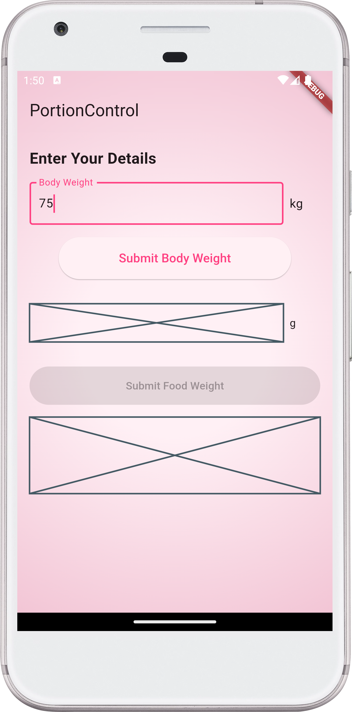

[](https://stand-with-ukraine.pp.ua)
[](https://pub.dev/packages/flutter_lints)


# PortionControl

**PortionControl** is a simple and intuitive Flutter app designed to help users
track their food intake and weight straightforwardly. The app allows users to
record their body weight and food portions, making it easier to monitor the
relationship between food consumption and weight changes.

## Features

- **Track Body Weight**: Enter your current body weight (in kilograms).
- **Track Food Portions**: Input food portion weight (in grams) before every
  meal.
- **Simple Interface**: The app focuses on simplicity, with no complex meal
  logging or calorie counting.
- **Recommendation Section** (Placeholder): A placeholder section that can later
  offer recommendations based on input data.

## Getting Started

To get started with the project, follow the steps below:

### Prerequisites

Before you begin, make sure you have the following installed:

1. **Flutter SDK**: You can follow the installation instructions on the
   [Flutter website](https://docs.flutter.dev/get-started/install).
2. **Android Studio** or **Visual Studio Code**: Preferred IDE for Flutter
   development.
3. **Dart SDK**: It comes bundled with Flutter, but ensure you’re on the latest
   stable version.

### Installation

Clone this repository to your local machine:

```bash
git clone https://github.com/Turskyi/portion_control.git
```

Navigate to the project directory:

```bash
cd portion_control
```

Install dependencies:

```bash
flutter pub get
```

### Running the App

To run the app, use the following command in your terminal:

```bash
flutter run
```

This will launch the app on your connected device or emulator.

## Project Structure

Here’s a breakdown of the main components in this Flutter app:

```
lib/
│
├── main.dart      # Main entry point of the app, sets up the theme and routing.
└── ui/
    home_page.dart # Home page layout and UI components.
```

## Code Explanation

`main.dart`

This file contains the main entry point for the app. It sets up the theme
(with a deep purple color scheme) and runs the `PortionControlApp`. The home
screen is defined here, with all basic UI elements and placeholders.

`home_page.dart`

Contains the layout for the home page, where users input their body weight and
food portion weight. Each input field is currently a `Placeholder` widget, to
be replaced later with actual input widgets.

`Theme`

The app uses `Material3` components and a color scheme seeded with
`Colors.deepPurple` to create a clean and vibrant user interface.

```dart
ThemeData(
  colorScheme: ColorScheme.fromSeed(seedColor: Colors.deepPurple),
  useMaterial3: true,
)
```

## Testing

### Widget Testing

Tests for this project ensure that the app’s UI components render correctly.
You can run the tests using the following command:

```bash
flutter test
```

Example tests provided in the `test/widget_test.dart` file verify the layout,
presence of text elements, and interaction with the placeholder buttons.

```dart
testWidgets('HomePage has correct layout and placeholders', (WidgetTester tester) async {
  // Build our app and trigger a frame.
  await tester.pumpWidget(const PortionControlApp());

  // Verify the presence of the title, text fields, and placeholders.
  expect(find.text('PortionControl'), findsOneWidget);
  expect(find.text('Enter Your Details'), findsOneWidget);
  expect(find.byType(Placeholder), findsNWidgets(4));
});
```

## Roadmap

This project is under active development. Future improvements and features will
include:

- **Functional Input Fields**: Replace Placeholder widgets with real input
  fields for body weight and food portions.
- **Submit Button Logic**: Implement the functionality of the submit button to
  store and track weight changes.
- **Recommendation Engine**: Based on entered data, provide recommendations or
  trends to the user.
- **Graphs/Charts**: Display weight change over time using graphs.
- **Notifications**: Remind users to track their weight and food portions daily.

## Contributing

We welcome contributions from the community! To contribute:

1. Fork this repository.
2. Create a new branch (git checkout -b feature-name).
3. Commit your changes (git commit -am 'Add feature').
4. Push to the branch (git push origin feature-name).
5. Create a new Pull Request.

Please ensure your code follows the existing style guidelines and includes
tests where applicable.

<details style="border: 1px solid #aaa; border-radius: 4px; padding: 0.5em 0.5em 0;">
  <summary style="font-weight: bold; margin: -0.5em -0.5em 0; padding: 0.5em; border-bottom: 1px solid #aaa;">Style guides:

[Style guide for Flutter](https://github.com/flutter/flutter/wiki/Style-guide-for-Flutter-repo),
[Dart style guide](https://dart.dev/effective-dart).

  </summary>

- [DO use trailing commas for all function calls and declarations unless the function call or definition, from the start of the function name up to the closing parenthesis, fits in a single line.](https://dart-lang.github.io/linter/lints/require_trailing_commas.html)

- [DON'T cast a nullable value to a non-nullable type. This hides a null check and most of the time it is not what is expected.](https://dart-lang.github.io/linter/lints/avoid_as.html)

- [PREFER using
  `const` for instantiating constant constructors](https://dart-lang.github.io/linter/lints/prefer_const_constructors.html)

If a constructor can be invoked as const to produce a canonicalized instance,
it's preferable to do so.

- [DO sort constructor declarations before other members](https://dart-lang.github.io/linter/lints/sort_constructors_first.html)

- ### Avoid Mental Mapping

A single-letter name is a poor choice; it’s just a placeholder that the reader
must mentally map to the actual concept. There can be no worse reason for using
the name `c` than because `a` and `b` were already taken.

- ### Method names

Methods should have verb or verb phrase names like `postPayment`, `deletePage`,
or `save`. Accessors, mutators, and predicates should be named for their value
and prefixed with `get`…, `set`…, and `is`….

- ### Use Intention-Revealing Names

If a name requires a comment, then the name does not reveal its intent.

- ### Use Pronounceable Names

If you can’t pronounce it, you can’t discuss it without sounding silly.

- ### Class Names

Classes and objects should have noun or noun phrase names and not include
indistinct noise words:

```
GOOD:
Customer, WikiPage, Account, AddressParser.

BAD:
Manager, Processor, Data, Info.
```

- ### Functions should be small

Functions should hardly ever be 20 lines long.
Blocks within if statements, else statements, while statements, and so on
should be **_one_** line long. Probably that line should be a function call.

- ### Functions should do one thing

To know that a function is doing more than “one thing” is if you can extract
another function from it with a name that is not merely a restatement of its
implementation.

- ### One Level of Abstraction per Function

We want the code to read like a top-down narrative. We want every function to
be followed by those at the next level of abstraction so that we can read the
program, descending one level of abstraction at a time as we read down the list
of functions.

- ### Dependent Functions

If one function calls another, they should be vertically close, and the caller
should be **_above_** the callee, if possible.

- ### Use Descriptive Names

Don’t be afraid to make a name long. A long descriptive name is better than a
short enigmatic name. A long descriptive name is better than a long descriptive
comment.

- ### Function Arguments

The ideal number of arguments for a function is zero (niladic). Next comes one
(monadic), followed closely by two (dyadic). Three arguments (triadic) should
be avoided where possible.

```
GOOD:
includeSetupPage()

BAD:
includeSetupPageInto(newPageContent)
```

- ### Flag Arguments

Flag arguments are ugly. Passing a boolean into a function is a truly terrible
practice. It immediately complicates the signature of the method, loudly
proclaiming that this function does more than one thing. It does one thing if
the flag is true and another if the flag is false!

```
GOOD:
renderForSuite()
renderForSingleTest()

BAD:
render(bool isSuite)
```

- ### Explain Yourself in Code

Only the code can truly tell you what it does. Comments are, at best, a
necessary evil. Rather than spend your time writing the comments that explain
the mess you’ve made, spend it cleaning that mess. Inaccurate comments are far
worse than no comments at all.

```
BAD:
// Check to see if the employee is eligible
// for full benefits
if ((employee.flags & hourlyFlag) && (employee.age > 65))

GOOD:
if (employee.isEligibleForFullBenefits())

```

- ### TODO Comments

Nowadays, good IDEs provide special gestures and features to locate all the
`//TODO` comments, so it’s not likely that they will get lost.

- ### Public APIs

There is nothing quite so helpful and satisfying as a well-described public API.
It would be challenging, at best, to write programs without them.

```dart
/// dart doc comment
```

- ### Commented-Out Code

We’ve had good source code control systems for a very long time now. Those
systems will remember the code for us. We don’t have to comment it out anymore.

- ### Position Markers

In general, they are the clutter that should be eliminated—especially the noisy
train of slashes at the end. If you overuse banners, they’ll fall into the
background noise and be ignored.

```dart
// Actions //////////////////////////////////
```

- ### Don’t Return Null

When we return `null`, we are essentially creating work for ourselves and
foisting problems upon our callers. All it takes is one missing `null` check to
send an app spinning out of control.

- ### Don’t Pass Null

In most programming languages, there is no **GOOD** way to deal with a `null`
that is passed by a caller accidentally. Because this is the case, the rational
approach is to forbid passing null by default. When you do, you can code with
the knowledge that a `null` in an argument list is an indication of a problem,
and end up with far fewer careless mistakes.

- ### Classes Should Be Small!

With functions, we measured size by counting physical lines. With classes, we
use a different measure. **We count responsibilities.** The Single
Responsibility Principle (SRP) states that a class or module should have one,
and only one, reason to change. The name of a class should describe what
responsibilities it fulfills. The more ambiguous the class name, the more
likely it has too many responsibilities. The problem is that too many of us
think that we are done once the program works. We move on to the next problem
rather than going back and breaking the overstuffed classes into decoupled
units with single responsibilities.

- ### Artificial Coupling

In general, an artificial coupling is a coupling between two modules that
serves no direct purpose. It is a result of putting a variable, constant, or
function in a temporarily convenient, though inappropriate, location. For
example, general `enum`s should not be contained within more specific classes
because this forces the app to know about these more specific classes. The same
goes for general purpose `static` functions being declared in specific classes.

- ### Prefer Polymorphism to If/Else or Switch/Case

There may be no more than one switch statement for a given type of selection.
The cases in that switch statement must create polymorphic objects that take
the place of other such switch statements in the rest of the system.

- ### Replace Magic Numbers with Named Constants

In general, it is a bad idea to have raw numbers in your code. You should hide
them behind well-named constants. The term “Magic Number” does not apply only
to numbers. It applies to any token that has a value that is not
self-describing.

- ## Encapsulate Conditionals

Boolean logic is hard enough to understand without having to see it in the
context of an `if` or `while` statement. Extract functions that explain the
intent of the conditional.

```
GOOD:
if (shouldBeDeleted(timer))

BAD:
if (timer.hasExpired() && !timer.isRecurrent())
```

- ### Avoid Negative Conditionals

Negatives are just a bit harder to understand than positives. So, when
possible, conditionals should be expressed as positives.

```
GOOD:
if (buffer.shouldCompact())

BAD:
if (!buffer.shouldNotCompact())
```

- ### Encapsulate Boundary Conditions

Boundary conditions are hard to keep track of. Put the processing for them in
one place.

```
BAD:
if (level + 1 < tags.length) {
  parts = Parse(body, tags, level + 1, offset + endTag);
  body = null;
}

GOOD:
int nextLevel = level + 1;
if (nextLevel < tags.length) {
  parts = Parse(body, tags, nextLevel, offset + endTag);
  body = null;
}
```

- ### Constants versus Enums

Don’t keep using the old trick of public `static` `final` `int`s. `enum`s can
have methods and fields. This makes them very powerful tools that allow much
more expression and flexibility.

</details>

## Contact

For any inquiries, please contact support@turskyi.com.

## Screenshot

<!--suppress CheckImageSize -->

